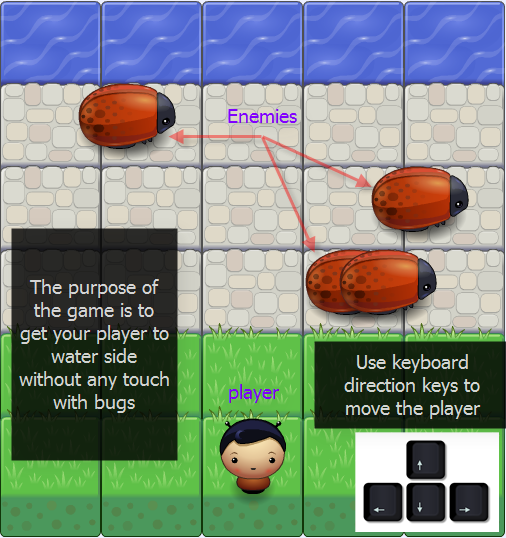

 Classic Arcade Game Clone Project

## Table of Contents

- [INSTRUCTIONS](#INSTRUCTIONS)
- [HOW TO PLAY](#HOW TO PLAY)
- [MORE DETAILS](#MORE DETAILS)
- [INFORMATION PANEL](#INFORMATION PANEL)
- [CONTACT INFO](#CONTACT INFO)
- [CONTRIBUTING](#CONTRIBUTING)

## INSTRUCTIONS
- The game is simple, it countains a player (you) and enemies (bugs).
- your role is to get your player to water avoiding collides with bugs.
- once you get the water without any touch with bugs you win a round.
- your score will increase deppending on total bugs speed.
- your player will get back to starting position for new turn and the bugs speeds will increase.
- as the bugs speeds increase, the round score will be heigher than previous.
- once you collide a bug your score will be set to ``0`` and you have to start over to get new score.

```Enjoy with your friends and challenge getting Best score.```

-  Playing Ground



## HOW TO PLAY

> You can move your player in four direction (right-left-up-down) using your keyboard arrow keys.
> Every key press will move the player one block.
> Try avoiding the bugs by menapulating the player right and left.

## MORE DETAILS

### Bugs speeds & Score

the speed of bugs is random only at the first round.
I made the score relating to bugs speeds just for being fair between different players as long as first rouns bugs speeds is random.


### Charachters

If you get bored of the main charachter, you can change it any time even during playing a round.
you have four additional  nice charachters
- cat-girl
- horn-girl
- pink-girl
- princess-girl

## INFORMATION PANEL

You have your score on the left of your panel.

Next to it there's the best score ever. this score will not updated untill you get heigher score or you click on "reset" button.

"reset" button will erase the recorded Best Score without any alert message!

At the right side of your panel you have the four player charachters that we mentioned.

Clicking on any of them at any time during the game will change the charechter to the selected one.

-  Information Panel


## CONTACT INFO

For any further information, I will be happy to hear from you.
[Hasan Shofan](mailto:Mark_mimo_marko@hotmail.com) 2019

## CONTRIBUTING
- download the .zip file.
- git clone
    `https://github.com/HasanSho/Classic-Arcade-Game.git`

